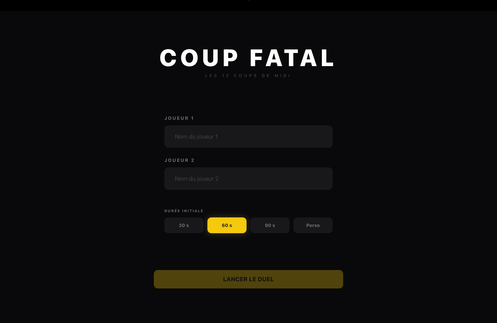
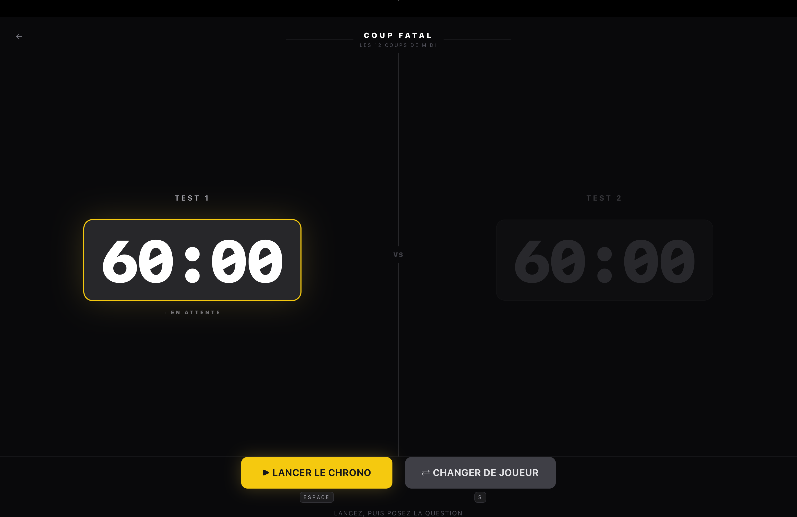
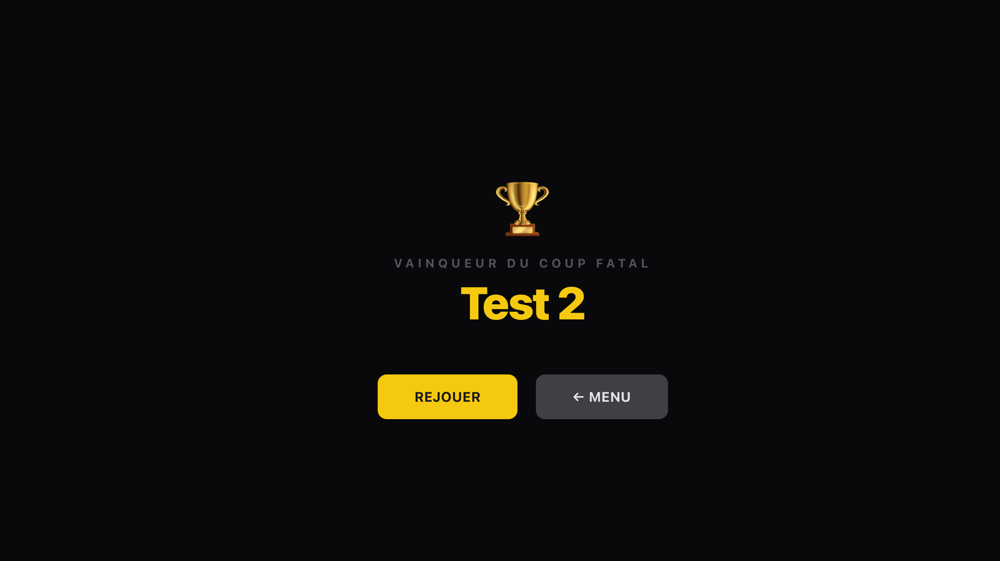

# Coup Fatal

Simulation du **Coup Fatal**, l'épreuve de demi-finale du jeu télévisé *Les 12 coups de midi*.

---

## Déroulement

### 1. Écran de configuration

Avant le duel, l'hôte saisit le nom des deux joueurs et choisit la durée initiale de chaque chronomètre (30, 60 ou 90 secondes).

### 2. Le duel

L'hôte pose les questions à voix haute. Il contrôle le déroulement via les boutons :

- **Lancer le chrono** — démarre le chrono du joueur actif une fois la question posée
- **Bonne réponse** — met le chrono en pause et passe la main à l'adversaire
- **Mauvaise réponse** — le chrono continue, l'hôte enchaîne avec une nouvelle question
- **Changer de joueur** — correction manuelle en cas d'erreur de l'hôte

Les deux chronos sont affichés en temps réel au format `SS:CC` (secondes:centisecondes). Le joueur actif est mis en valeur, l'autre est estompé.

### 3. Écran vainqueur

Dès qu'un chrono atteint zéro, le duel s'arrête et le vainqueur est annoncé. L'hôte peut alors relancer un duel avec les mêmes joueurs ou revenir au menu.

---

## Règles

- Le chrono ne tourne que pour le joueur actif
- Il s'arrête uniquement sur une bonne réponse
- Une mauvaise réponse ou un passe laisse le chrono tourner
- Le premier joueur dont le chrono atteint zéro est éliminé

---

## Stack technique

- **React 18** + **TypeScript**
- **Vite**
- **Zustand** — gestion d'état global
- **Tailwind CSS v4**
